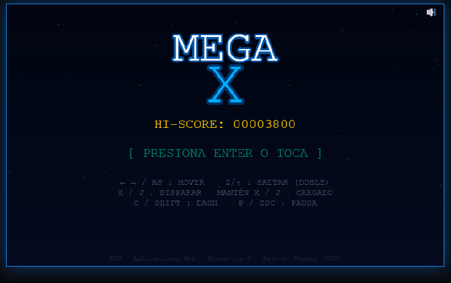
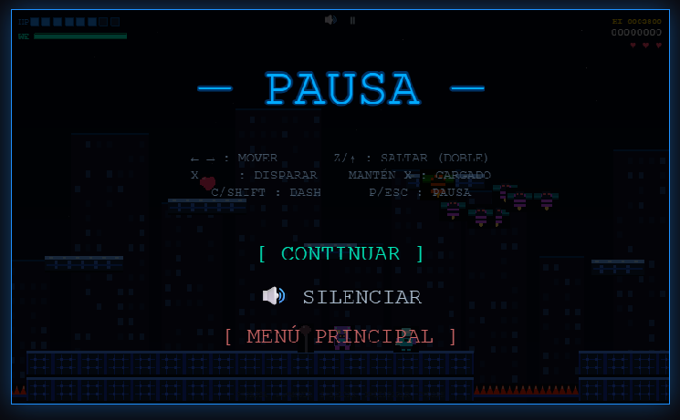
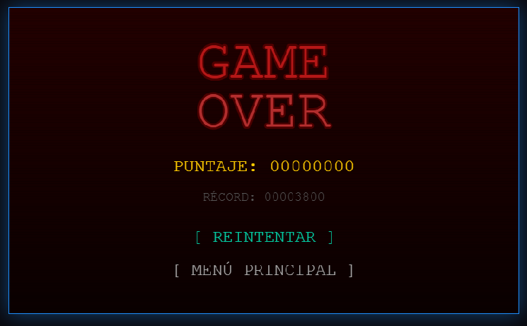
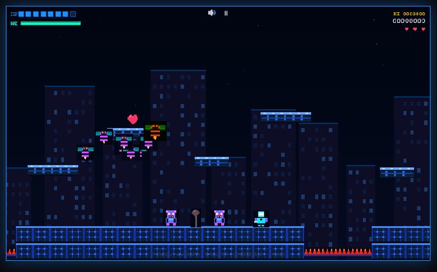
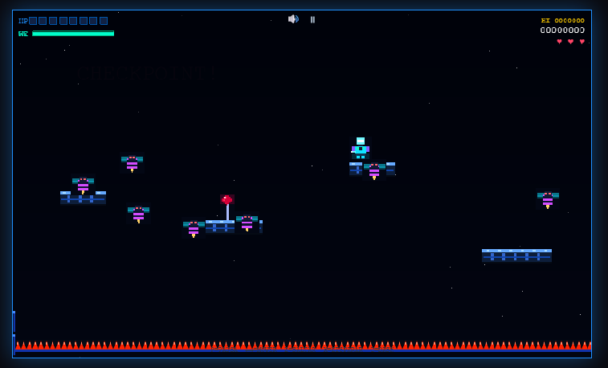
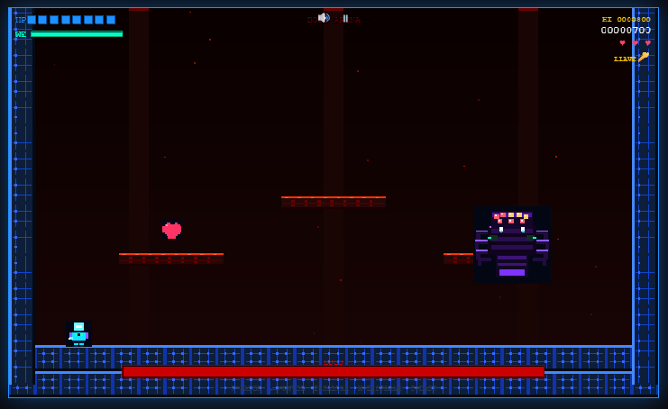

# 🎮 MEGA X - Juego de Plataformas 2D (Estilo Megaman)

Un dinámico videojuego de acción y plataformas en 2D desarrollado con **Phaser 3** y empaquetado mediante **Vite**. El proyecto destaca por su enfoque modular y una arquitectura orientada a objetos que implementa mecánicas robustas de disparo (normal y cargado), habilidades de desplazamiento rápido (*dash*), sistemas de reciclaje de proyectiles (*object pooling*), e Inteligencia Artificial variada para enemigos terrestres, voladores, guardianes de llaves y jefes mecánicos gigantes con fases dinámicas de combate.

---

## 📷 Capturas de Pantalla (Gameplay)

A continuación se muestran los marcadores de posición para las capturas de pantalla de los principales escenarios y menús del juego. 

### 🖥️ Menús e Interfaces
| 🎮 Menú Principal | ⏸️ Menú de Pausa | 💀 Pantalla de Game Over |
| :---: | :---: | :---: |
|  <br> *Inicio, Hi-Score y controles* |  <br> *Interrupción y ajuste de volumen* |  <br> *Reintentos y guardado de récords* |

### 🕹️ Niveles y Escenarios de Juego
| 🏙️ Stage 1: La Ciudad | 🌌 Stage 2: El Abismo | 🕷️ Arena del Jefe Final |
| :---: | :---: | :---: |
|  <br> *Mecánica de llaves y plataformas estables* |  <br> *Generación dinámica de enemigos y vacío* |  <br> *Combate final contra la araña mecánica* |

---

## ⚡ Elementos Gráficos y Sprites (Procedurales)

Todas las texturas e imágenes del juego se generan dinámicamente mediante código canvas en `GraphicsFactory.js`, asegurando un renderizado pixel-art limpio, rápido y libre de dependencias externas de archivos de imagen pesados.


## 🚀 Guía de Ejecución Local

Para ejecutar el proyecto en tu entorno local, asegúrate de tener instalado [Node.js](https://nodejs.org/) (versión 16 o superior).

### 1. Clonar el repositorio e instalar dependencias
Abre tu terminal en la carpeta raíz del proyecto e instala los módulos necesarios:
```bash
npm install
```

### 2. Ejecutar el servidor de desarrollo
Inicia el entorno local con recarga en vivo provisto por Vite:
```bash
npm run dev
```
Una vez iniciado, abre tu navegador web en la dirección local indicada (usualmente `http://localhost:3000` o `http://localhost:5173`).

### 3. Construir para producción
Para compilar y optimizar todos los recursos de cara a su distribución final en producción:
```bash
npm run build
```
Los archivos optimizados se generarán dentro del directorio `dist/`.

---

## 🕹️ Controles del Juego

El sistema soporta tanto controles nativos por teclado (PC) como una interfaz táctil mapeada dinámicamente en pantalla para dispositivos móviles.

### Teclado (PC)

| Acción | Teclas Soportadas | Descripción |
| :--- | :--- | :--- |
| **Moverse a la Izquierda** | `⬅️ Flecha Izquierda` / `A` | Desplaza al jugador hacia la izquierda. |
| **Moverse a la Derecha** | `➡️ Flecha Derecha` / `D` | Desplaza al jugador hacia la derecha. |
| **Saltar / Doble Salto** | `⬆️ Flecha Arriba` / `W` / `Z` | Permite realizar hasta dos saltos consecutivos en el aire. |
| **Desplazamiento (*Dash*)** | `C` / `SHIFT` | Impulso rápido horizontal en la dirección actual. |
| **Disparar Normal** | Presión rápida en `X` o `J` | Lanza un proyectil estándar (gasta 2 de energía). |
| **Disparo Cargado** | Mantener presionado `X` o `J` (>800ms) | Desata un mega proyectil de alto impacto (gasta 14 de energía). |
| **Pausar Juego** | `P` / `ESC` | Detiene de forma segura el tiempo y abre el menú de pausa. |

---

## 📁 Estructura del Proyecto

El código fuente está diseñado bajo un enfoque modular y orientado a componentes, distribuyéndose de la siguiente manera:

```
juego_plataforma2d/
├── public/
│   └── assets/               # Carpeta opcional para recursos estáticos externos
├── src/
│   ├── audio/
│   │   └── AudioManager.js   # Administrador de música (BGM) y efectos (SFX) usando Web Audio API
│   ├── managers/
│   │   ├── GraphicsFactory.js# Generación procedural de texturas e imágenes con Canvas 2D
│   │   └── StorageManager.js # Persistencia en LocalStorage (Highscores, volumen, niveles)
│   ├── objects/
│   │   ├── Player.js         # Clase del jugador: físicas, estados, invencibilidad y buster
│   │   └── Enemy.js          # Clases base de IA (EnemyGround, EnemyFlying, EnemyKeyHolders, Boss)
│   ├── physics/
│   │   └── CollisionHelper.js# Centralizador de colisiones y solapamientos (overlaps) de Arcade Physics
│   ├── scenes/
│   │   ├── BootScene.js      # Inicialización del registro global de datos
│   │   ├── PreloadScene.js   # Pantalla de carga y pipeline gráfico procedural
│   │   ├── MenuScene.js      # Pantalla principal de inicio con récords e instrucciones
│   │   ├── Stage1Scene.js    # Nivel 1 (Ciudad): Mecánica de puerta blindada y portador de llave
│   │   ├── Stage2Scene.js    # Nivel 2 (Abismo): Enfoque aéreo, caída mortal y generadores dinámicos
│   │   ├── BossScene.js      # Arena de combate final contra la araña mecánica gigante
│   │   ├── HUDScene.js       # Capa de interfaz de usuario en tiempo real (barras HP, Energía, Score)
│   │   ├── PauseScene.js     # Menú interactivo de interrupción del juego
│   │   ├── GameOverScene.js  # Pantalla de derrota, reintentos y actualización de récords
│   │   └── VictoryScene.js   # Pantalla de éxito tras neutralizar al jefe
│   ├── ui/
│   │   └── HUD.js            # Lógica de renderizado y refresco periódico de barras de estado
│   └── main.js               # Punto de entrada de Vite y configuración del motor Phaser.Game
├── index.html                # Contenedor HTML principal del lienzo y botones táctiles integrados
└── vite.config.js            # Archivo de configuración del empaquetador Vite
```

---

## 🛠️ Características Técnicas Avanzadas

1. **Object Pooling para Proyectiles:** Las ráfagas de disparos normales y cargados se gestionan reutilizando instancias de cuerpos físicos inactivos dentro de un pool estricto de Phaser, minimizando la recolección de basura (*Garbage Collection*) y asegurando un rendimiento estable a 60 FPS.
2. **Generador Cíclico Dinámico (Stage 2):** Implementation de un *Spawner* controlado por eventos de tiempo adaptativos que calcula la posición horizontal por delante del jugador para instanciar drones aéreos de manera infinita mientras cruza el abismo, deteniéndose de manera segura al tocar zona firme.
3. **Mecánica de Progresión Condicional (Llave/Puerta):** Separación de responsabilidades lógicas donde ciertos enemigos (`EnemyFlyingKeyHolder`) heredan comportamientos base pero gatillan eventos personalizados en la escena al morir, obligando al jugador a explorar y combatir antes de desbloquear los colisionadores de las compuertas de transición.
4. **Sistema de Invencibilidad Robusto:** El estado de daño por colisión limpia de forma estricta los temporizadores antiguos en el *respawn*, controlando estados mediante opacidades alternas parpadeantes para evitar colisiones redundantes continuadas en zonas críticas o de picos (*spikes*).

---

## 👥 Créditos

Proyecto desarrollado por:

- David Puga
- Joseph Jimenez
- Francis Bravo

*Desarrollado con pasión utilizando Phaser 3 como framework principal de desarrollo web 2D.*
